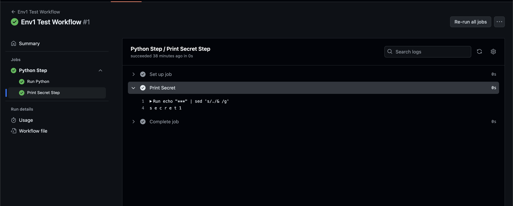

## CI/CD Lab

This repo is for my bootcamp lab on CI/CD! I'm using GitHub Actions to create a workflow that adds two numbers together using Python.

**Summary:**

- **`template.yml`:** This file defines the workflow. It runs two jobs:
  - `run_python`: Runs my Python script `src/trial.py` to add the numbers.
  - `print_secret`: Shows how to access a secret in the workflow.
- **`src/trial.py`:** You can find the Python file in this directory.

**What I did to run the workflow:**

1. **Set up Env:** Went to repo settings -> Environments -> New Environment.
2. Created two environments groups based on the settings given to us.

**Screenshots:**

    

    

    

    

